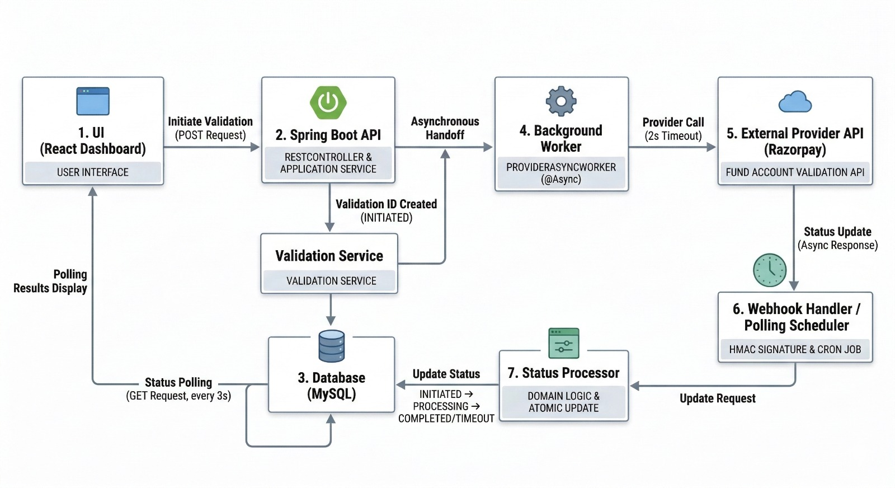
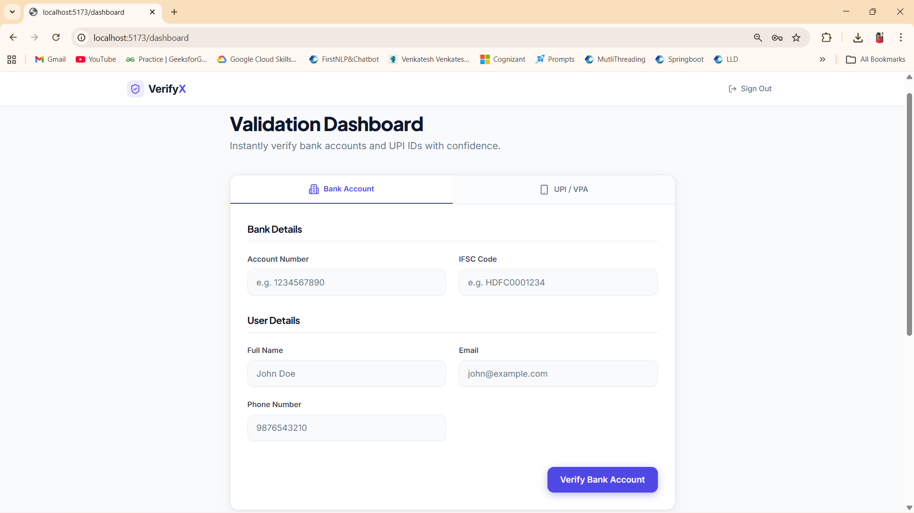
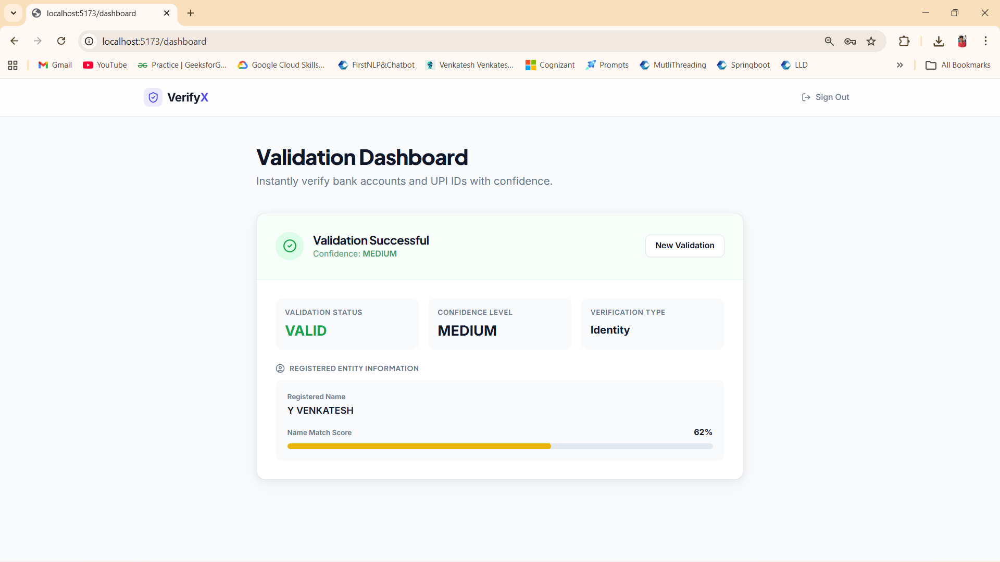
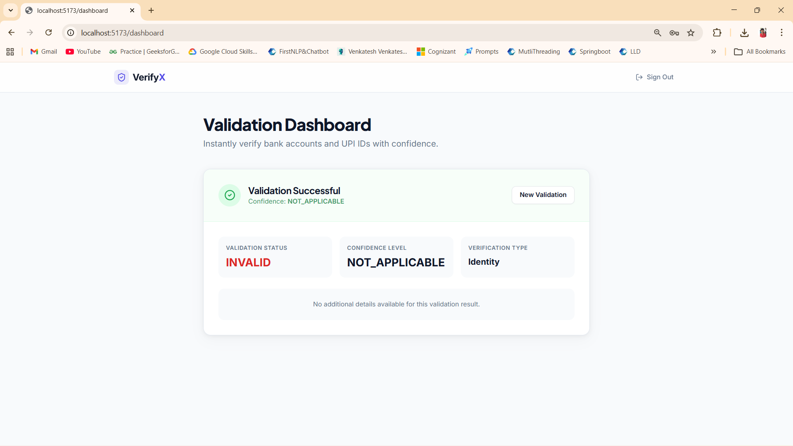

# Financial Validation Engine

A **fault-tolerant financial validation system** built using **Java + Spring Boot** that validates **bank accounts or VPAs** through external payment providers.

The project demonstrates how **real financial backend systems handle asynchronous processing, provider integrations, and failure recovery.**

---

## 🚀 Project Overview

| Feature | Description |
|------|-------------|
| Architecture | Asynchronous validation pipeline |
| Backend | Java + Spring Boot |
| Security | JWT Authentication + HMAC Webhook Validation |
| Processing | Background Worker Processing |
| Integration | External Payment Provider APIs |
| Reliability | Retry + Scheduler Recovery |
| Database | MySQL |

---

## 📑 Table of Contents

- [Project Demo](#project-demo)
- [System Architecture](#system-architecture)
- [Validation Lifecycle](#validation-lifecycle)
- [Request Processing Flow](#request-processing-flow)
- [Failure Handling](#failure-handling)
- [Security](#security)
- [UI Screenshots](#ui-screenshots)
- [Tech Stack](#tech-stack)
- [Backend Concepts Demonstrated](#backend-concepts-demonstrated)
- [Future Improvements](#future-improvements)

---

## Project Demo

🎥 **Watch the System Demo**

👉 [Watch Demo Video](https://drive.google.com/file/d/1sAMhtqYEhAUSptF8p_Rug2sZc9L6B98m/view?usp=sharing)

The demo shows:

1. User login  
2. Validation request submission  
3. Async worker processing  
4. Provider API integration  
5. Webhook callback handling  
6. Final validation result in UI  

---

## System Architecture



### High Level Flow

```
UI
↓
Spring Boot API
↓
Validation Service
↓
Background Worker
↓
External Provider API
↓
Webhook Handler
↓
Event Processor
↓
Database
↓
UI Polling Result
```

The system processes validations **asynchronously**, ensuring the UI remains responsive while external validations are completed.

---

## Validation Lifecycle

Each validation request moves through defined states.

```
INITIATED
↓
PROCESSING
↓
COMPLETED / FAILED / PROVIDER_CALL_TIMEOUT
```

This **state-driven design** prevents duplicate processing and supports safe retries.

---

## Request Processing Flow

```
User Request
↓
Spring Boot Controller
↓
Validation Service
↓
Persist Validation Request
↓
Background Worker Picks Task
↓
Provider API Call
↓
Provider Sends Webhook
↓
Event Processor Updates Result
↓
Database Updated
↓
UI Polling Returns Final Status
```

This architecture ensures **non-blocking request processing**.

---

## Failure Handling

External provider integrations can fail or respond slowly.  
The system includes **automatic recovery mechanisms**.

### Webhook Recovery

If a webhook is delayed or not received:

```
Polling Scheduler
↓
Check validation status
↓
Update database
```

### Provider Timeout Recovery

If a provider call fails:

```
Reconciliation Scheduler
↓
Retry pending validations
↓
Update final status
```

These mechanisms ensure **eventual consistency**.

---

## Security

### Authentication

- Spring Security
- JWT Authentication

### Webhook Protection

- HMAC Signature Verification
- Ensures callbacks originate from trusted providers

---

## UI Screenshots

### Dashboard



### Validation Result (Valid)



### Validation Result (Invalid)



---

## Tech Stack

### Backend

- Java 17
- Spring Boot
- Spring Security
- JPA / Hibernate

### Database

- MySQL

### Integration

- External Payment Provider APIs
- Webhook callbacks

### Async Processing

- Background workers
- Scheduler jobs

---

## Backend Concepts Demonstrated

This project demonstrates several **real-world backend engineering patterns**:

- Asynchronous request processing
- Webhook-driven architecture
- Background worker processing
- Scheduler-based failure recovery
- Idempotent validation handling
- Secure API authentication using JWT
- Event-driven validation lifecycle

---

## Future Improvements

Possible production enhancements:

- Message queues (Kafka / RabbitMQ)
- Distributed worker scaling
- Circuit breaker for provider APIs
- Monitoring dashboards
- API rate limiting

---

## Author

**Venkatesh**  
Backend Developer
